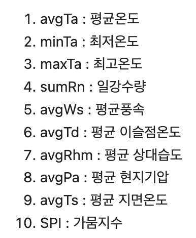
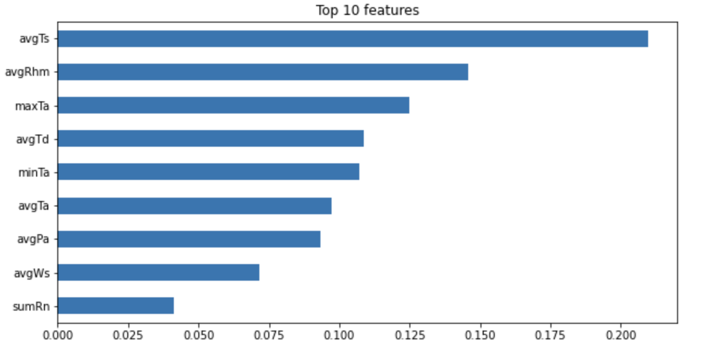
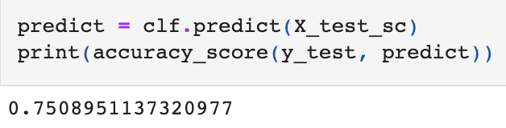
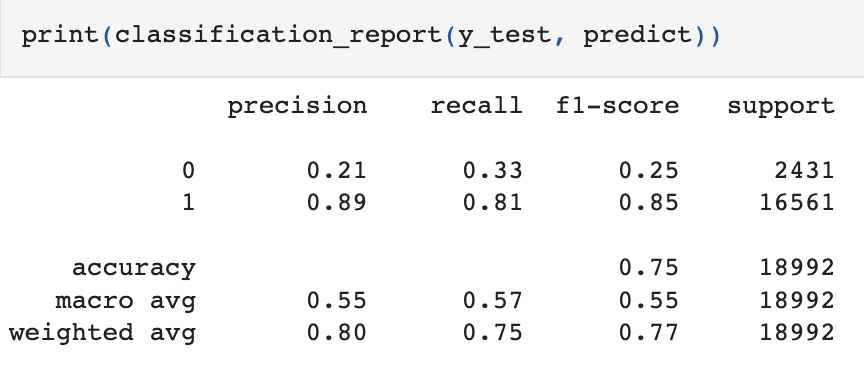
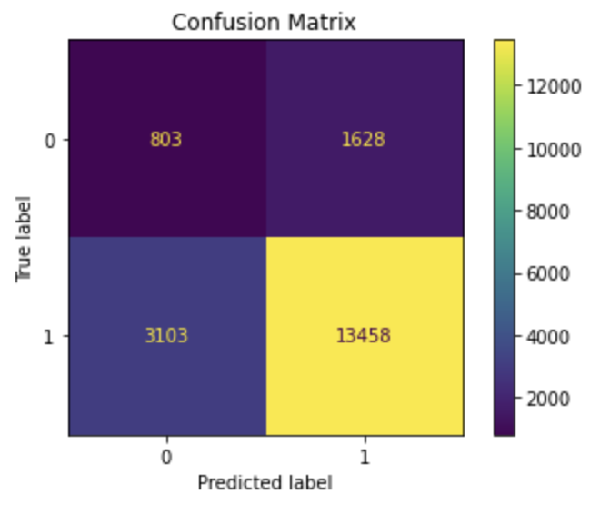
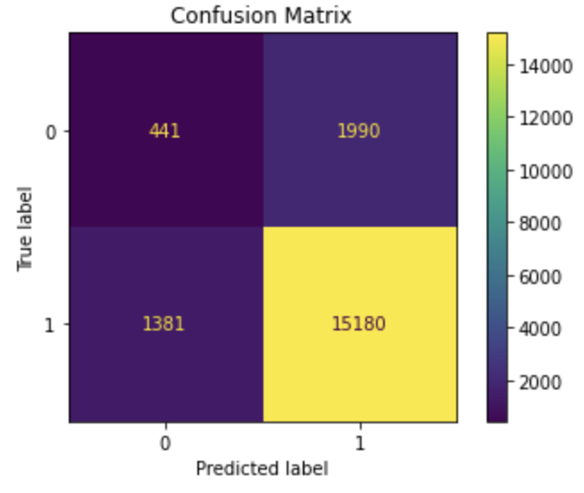

# drought_ds

전체 과정 및 소개 링크 : https://github.com/JongjunHan/drought_cp
배포 주소 : https://drought-info.herokuapp.com

## 프로젝트 내용 및 목표

- ASOS(종관기상관측)자료와 SPI(표준강수지수)를 이용한 가뭄 예측 모델링 과정

- 해당 지역은 호남지역이며 이는 호남지역이 최근 가장 큰 피해를 호소하고 있기 때문

- target은 SPI 지수로, SPI 지수를 예측하여 그에 맞는 가뭄을 예측함

- 모델을 제작함에 따라 각 단계 별 가뭄 예측을 하고, 모델을 통한 서비스 제작에 이바지 하고자 함

## 데이터 수집 과정

- 기상자료개방포털(https://data.kma.go.kr/cmmn/main.do)의 Open API를 이용한 수집

   
  
   

- 각 columns의 세부 정보는 이러한 형태를 보임

## 모델링 과정

- 전처리 과정에서 SPI 지수의 라벨링을 진행하함

- SPI 지수가 일정 수치 이상 올라가면 가뭄이라고 판단이 가능하기에 그 범위에 따라 '가뭄이다 아니다'의 이진 분류 형태로 전처리를 진행함

- 모델의 경우는 여러 모델을 기본적으로 사용한 결과 RandomForest의 분류 모델을 사용하게 됨

- 기본 RandomForest모델 사용, SMOTE 기법을 통한 데이터 증식, 다운샘플링, 임계치 조절을 진행

   
  
   

- 특성 중요도에 대한 분석 결과로 빼야할 특성이 없다고 판단

## 모델링 결과

   
  
   

- 여기서 보이는 accuracy score는 기본 모델의 성능이며 0.75 정도의 성능을 보임

   
  
   

- 이 경우에 accuracy score 만 보는 것이 아닌 f1-score와 recall, precision에 대한 분석을 같이 진행해야 정교한 분석을 통한 최종 모델을 선정해야함

- accuracy score의 경우 다른 전처리 과정을 통하여 만든 RandomForest 모델이 0.8 정도로 더 높은 수치를 보이기도 함

   
  
   

   
  
   

- 기본 모델과 다른 방법을 사용한 모델들의 비교 분석 결과, f1-score, precision, recall 등 다른 지표들이 굉장히 편파적이고 편협적인 형태를 띄는 것으로 볼 수 있음

- 성능을 0.5 정도 높이고자, 가뭄예측에 대한 정확한 true값과 predict값에 대해 오히려 좋지 못한 결과를 보이는 모델을 사용하는 것은 오히려 성능을 떨어트린다고 생각함

- 마지막으로 임계치 조절을 통한 최적 임계치를 찾아 냈지만, 이 역시 원래 기본 모델에 비해 많이 성능이 떨어진다고 볼 수가있음

- 결국 마지막으로 사용할 모델은 RandomForest의 기본 모델

## 회고

- 모델링 과정에서 처음 회귀모델을 사용하려 했으나 굉장히 낮은 성능을 보였기 때문에 타겟값의 라벨링을 통한 분류 모델을 사용하기로 했음

- 전처리의 형식에 따라 머신러닝 모델의 성능은 굉장히 다르게 나타날 수 있다는 것과 결과 분석에 있어서 굉장히 많은 긍정적 자체 평가 및 학습을 하게 되었음

- 환경이라는 도메인에서 가뭄이라는 세부 도메인까지 새롭게 공부하고 논문들을 통한 학습 결과 프로젝트 기간 동안 긍정적인 자체 평가를 할 수 있게 되었다고 생각함

